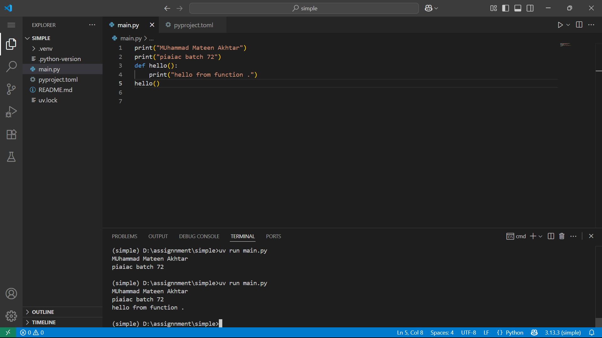

📂 Simple App

This is a Simple UV Application.
It demonstrates running a Python file directly using UV.

✅ Features

Prints Name and Roll Number

Very lightweight and easy to run

No packaging required

🚀 Example Output

Here’s a screenshot of the terminal showing successful run:

